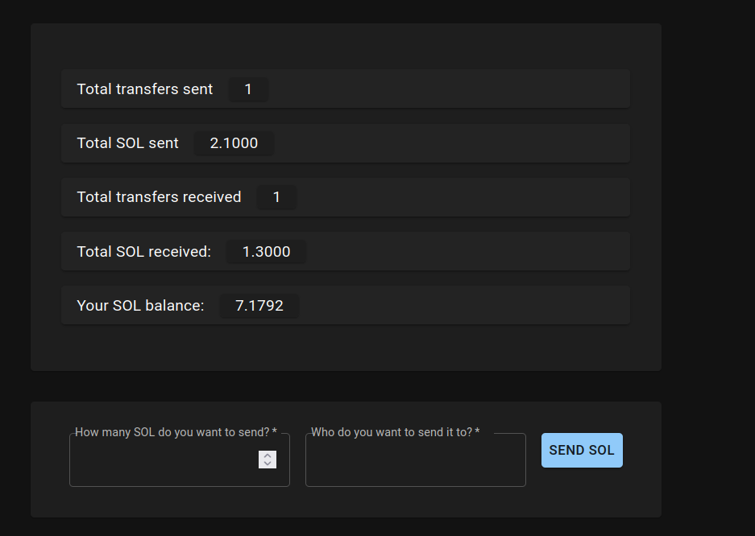

# Simple anchor dapp

This is a simple solana dapp.

The logic of the dapp is simple. 
 - Anyone can create an account
 - A user with an account can send `SOL` to another user with an account
 - The following stats are recorded on chain
   - Total transfers sent
   - Total transfers received
   - Total `SOL` sent
   - Total `SOL` received


## Program (smart contract)
The program is written using anchor protocol.

The program is deployed to **Devnet**. You can find the contract at : `66aoA3njN9pM3WyaaVr3PcLViq6aZycPR3Pf4bz3qtCU`

> `Solana version 1.9.21` and `Anchor version 0.24.2` were used to develop/test this program

Build the project
```
anchor build
```

Run the [tests](/tests)

```
anchor test
```

### Instructions
---

**create_account** ()

#### Accounts

| Name | Description | References & Notes|
| :------ | :------ | :------ |
| `authority` |The account which creates the user account | ***Signer***|
| `user` | The user account to be created (**init**) ||
| `stats` | The account which stats are stored (**init**) ||
| `system_program` | System Program | [SystemProgram.programId](https://solana-labs.github.io/solana-web3.js/classes/SystemProgram.html#programId)

---
**send_sol** (amount)

#### Parameters

| Name | Type | Description |
| :------ | :------ | :------ |
| `amount` | `u64` | Amount to send in lamports

#### Accounts

| Name | Description | References & Notes|
| :------ | :------ | :------ |
| `authority` |The account which sends SOL | ***Signer***|
| `from` | The user-account of the sender ||
| `from_stats` | The stats-account of the sender ||
| `to` | The user-account of the the receiver ||
| `from_stats` | The stats-account of the receiver ||
| `reciever` | The account which recieves SOL ||
| `system_program` | System Program | [SystemProgram.programId](https://solana-labs.github.io/solana-web3.js/classes/SystemProgram.html#programId)

---

## Frontend

A simple React based frontend is deployed at [http://simple-anchor-dapp.s3-website-us-east-1.amazonaws.com/](http://simple-anchor-dapp.s3-website-us-east-1.amazonaws.com/)

*Please make sure you are on Devnet and have some Devnet SOL in your wallet before testing the frontend*



You can find the code for frontent in [app](/app) directory

